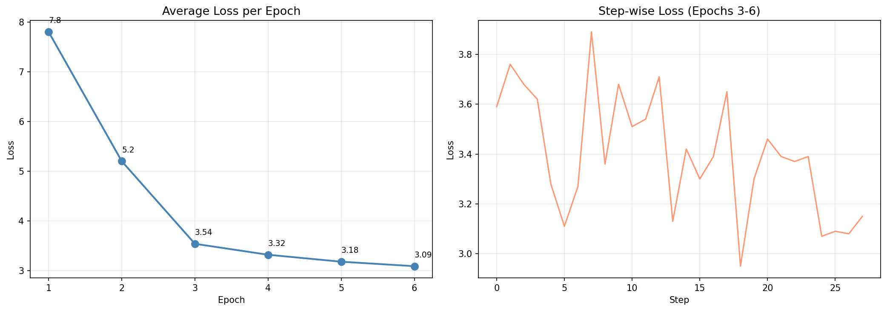
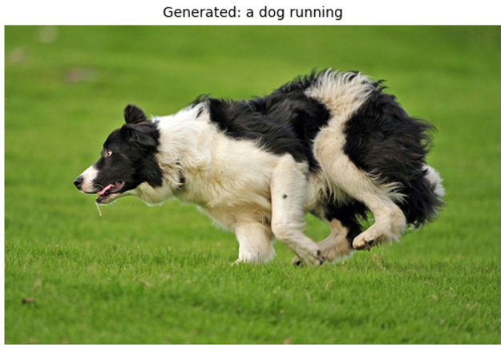
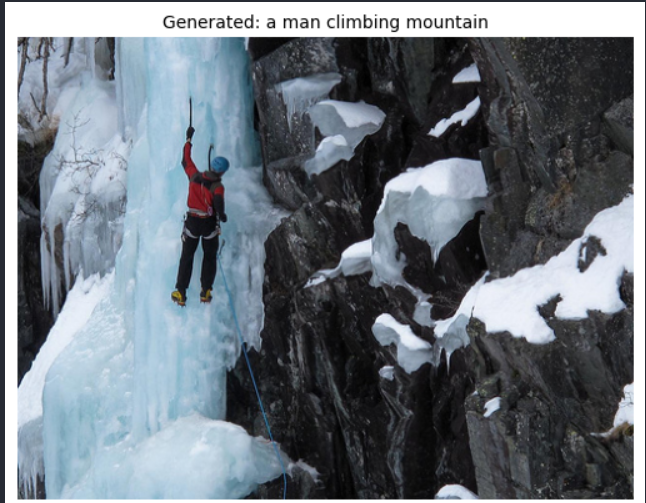
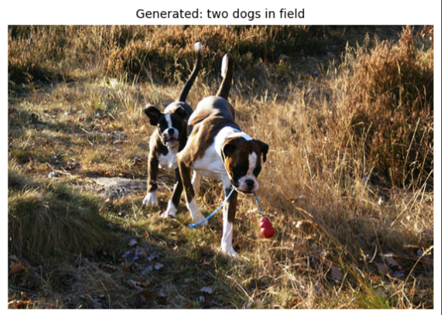
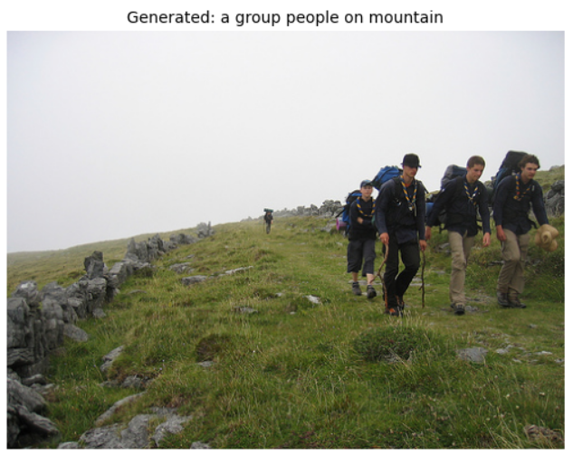

# Image Caption Generator using Vision Transformer (ViT)

An end-to-end deep learning pipeline that generates natural language captions for images using a pretrained Vision Transformer (ViT) encoder and an LSTM decoder.

This project explores how transformer-based visual representations can be combined with sequence generation models for image captioning tasks. The encoder extracts semantic image features using self-attention, while the decoder learns to generate human-like textual descriptions from those features.

Built using PyTorch and trained on the Flickr8k dataset.

---

# Project Motivation

Traditional image captioning systems commonly used CNN backbones such as ResNet or VGG for feature extraction. However, with the rise of Vision Transformers, attention-based architectures have demonstrated stronger global context understanding compared to convolutional networks.

The objective of this project was to:

- Understand Vision Transformers beyond theory
- Apply transformer-based image representations to a generative task
- Build a complete caption generation pipeline from scratch
- Explore transfer learning using pretrained ViT encoders
- Compare classical sequence decoders with transformer-based visual encoders

Rather than focusing only on benchmark scores, the project emphasizes architectural understanding and implementation clarity.

---

# Architecture Overview

```text
Input Image (224×224)
        │
        ▼
Pretrained ViT Encoder
(google/vit-base-patch16-224)
        │
        ▼
CLS Token Embedding (768-dim)
        │
        ▼
Linear Projection Layer
(768 → 512)
        │
        ▼
2-Layer LSTM Decoder
        │
        ▼
Word-by-word Caption Generation
        │
        ▼
Beam Search Decoding
```

---

# Model Components

## 1. Vision Transformer Encoder

### Encoder Used
- `google/vit-base-patch16-224`
- Pretrained on ImageNet-21k
- Imported from HuggingFace Transformers

### Why ViT?

Unlike CNNs that process local receptive fields, Vision Transformers split images into patches and use self-attention to model global relationships between all regions of the image simultaneously.

This allows the model to:
- Capture long-range spatial dependencies
- Learn richer semantic representations
- Understand overall scene context better

### Patch Embedding

The input image is divided into:

- 16×16 patches
- Total patches per image: 196
- Each patch converted into embeddings

These embeddings pass through transformer encoder layers using multi-head self-attention.

---

## 2. CLS Token Representation

A special learnable `[CLS]` token is prepended to the sequence of image patches.

After passing through transformer layers, the CLS token acts as a compressed representation of the entire image.

Output dimension:
```text
768-dimensional vector
```

This vector is used as the visual context for caption generation.

---

## 3. LSTM Decoder

The decoder is responsible for generating captions sequentially.

### Configuration

| Parameter | Value |
|---|---|
| Layers | 2 |
| Hidden Size | 512 |
| Embedding Size | 512 |
| Vocabulary Size | 4097 |
| Decoder Type | LSTM |

### Why LSTM Instead of Transformer Decoder?

A transformer decoder would provide stronger performance, but the LSTM was intentionally chosen because:

- Lower computational cost
- Easier training on limited GPU hardware
- Simpler architecture for studying encoder behavior
- Classical image captioning baseline comparison

The project focuses more on understanding the ViT encoder representation than maximizing benchmark performance.

---

# Transfer Learning Strategy

The ViT encoder is fully frozen during training.

Only the decoder parameters are updated.

## Why freeze the encoder?

The original ViT paper showed that transformers require massive datasets for effective training. Flickr8k contains only 8,000 images, which is insufficient for training ViT from scratch.

Using a pretrained encoder provides:
- Strong visual representations immediately
- Faster convergence
- Lower training cost
- Better generalization

Trainable parameters:
```text
~8.7 Million (decoder only)
```

---

# Dataset

## Flickr8k Dataset

| Property | Value |
|---|---|
| Images | 8,000 |
| Captions | 40,455 |
| Captions per image | 5 |

Each image is paired with multiple human-written captions.

---

# Vocabulary Construction

A custom vocabulary was built from the training captions.

### Vocabulary Details

| Setting | Value |
|---|---|
| Minimum word frequency | 3 |
| Final vocabulary size | 4097 |

### Special Tokens

```text
<PAD>  Padding
<SOS>  Start of sentence
<EOS>  End of sentence
<UNK>  Unknown word
```

Rare words are mapped to `<UNK>` to improve training stability.

---

# Training Configuration

| Parameter | Value |
|---|---|
| Optimizer | Adam |
| Learning Rate | 3e-4 |
| Batch Size | 32 |
| Epochs | 6 |
| Loss Function | CrossEntropyLoss |
| Gradient Clipping | 1.0 |
| Hardware | NVIDIA RTX 3050 |

---

# Training Loss

| Epoch | Average Loss |
|---|---|
| 1 | 7.80 |
| 2 | 5.20 |
| 3 | 3.54 |
| 4 | 3.32 |
| 5 | 3.18 |
| 6 | 3.09 |

## Loss Curve



The model learns sentence structure rapidly during the first few epochs and gradually improves semantic consistency afterward.

---

# Inference Strategy

## Beam Search Decoding

Instead of greedy decoding, beam search is used during inference.

### Beam Width
```text
5
```

### Why Beam Search?

Greedy decoding often produced:
- Repetitive words
- Incomplete captions
- Poor grammatical structure

Beam search maintains multiple candidate sequences simultaneously and selects the most probable final caption.

This significantly improved output quality.

---

# Generated Caption Examples

| Image | Generated Caption |
|---|---|
|  | "a dog running" |
|  | "a man climbing mountain" |
|  | "two dogs in field" |
|  | "a group people on mountain" |

---

# Observed Limitations

Although the model generates semantically meaningful captions, several limitations remain:

## 1. Grammatical Errors
Small datasets limit language fluency.

Examples:
- Missing articles
- Incorrect verb forms
- Weak sentence structure

---

## 2. Vocabulary Constraints

Rare objects are often replaced by generic words because of the vocabulary cutoff.

---

## 3. Single CLS Representation

The decoder only receives one global image vector.

This limits fine-grained spatial understanding compared to modern cross-attention architectures like BLIP or OFA.

---

# Future Improvements

## Transformer Decoder

Replace the LSTM with a transformer decoder using cross-attention over all patch tokens.

This would allow the decoder to focus on specific image regions while generating words.

---

## COCO Caption Dataset

Scale training from Flickr8k to MS COCO for:
- Larger vocabulary
- Better grammar
- More diverse captions

The current codebase already supports COCO with minor configuration changes.

---

## Feature Caching

Cache ViT embeddings before training.

This avoids recomputing encoder outputs every epoch and dramatically speeds up training.

---

## BLEU / CIDEr Evaluation

Add quantitative evaluation metrics commonly used in image captioning research.

---

## Attention Visualization

Visualize which image patches influence each generated word.

Useful for:
- Interpretability
- Debugging
- Understanding transformer attention behavior

---

# Repository Structure

```text
.
├── caption_vit.ipynb
├── README.md
├── loss_curve.png
├── samples/
│   ├── dog_running.png
│   ├── man_climbing.png
│   ├── two_dogs.png
│   └── group_mountain.png
```

---

# Setup Instructions

## Clone Repository

```bash
git clone https://github.com/satchelout-t/Image-caption-generator-using-ViT.git
cd Image-caption-generator-using-ViT
```

---

## Install Dependencies

```bash
pip install torch torchvision transformers Pillow matplotlib
```

---

# Dataset Setup

Download Flickr8k from Kaggle:

https://www.kaggle.com/datasets/adityajn105/flickr8k

Arrange files as:

```text
project/
├── flickr8k/
│   ├── Images/
│   └── captions.txt
├── caption_vit.ipynb
```

---

# Run Training

Open:

```text
caption_vit.ipynb
```

Run all notebook cells sequentially.

---

# Project Background

This repository is part of a two-stage Vision Transformer learning project.

## Stage 1 — ViT From Scratch

Implemented:
- Patch embeddings
- CLS token
- Positional encoding
- Multi-head self-attention
- Transformer encoder blocks
- MLP classification head

Trained on MNIST classification.

Achieved:
```text
88.9% Test Accuracy
```

Repository:
https://github.com/satchelout-t/vit-from-scratch

---

## Stage 2 — Image Captioning

This repository extends the ViT architecture to a generative downstream task by replacing the classification head with an LSTM language decoder.

---

# References

## Papers

- Dosovitskiy et al. — *An Image is Worth 16x16 Words*
- Vaswani et al. — *Attention Is All You Need*
- Vinyals et al. — *Show and Tell: A Neural Image Caption Generator*

---

# Author

Harpreet Singh

Built as part of a deep learning and computer vision exploration focused on Vision Transformers, attention mechanisms, and generative AI systems.
